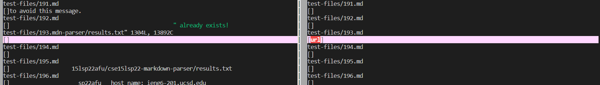
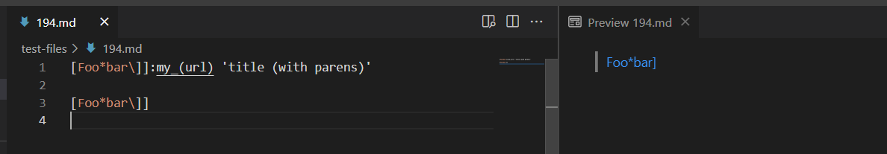
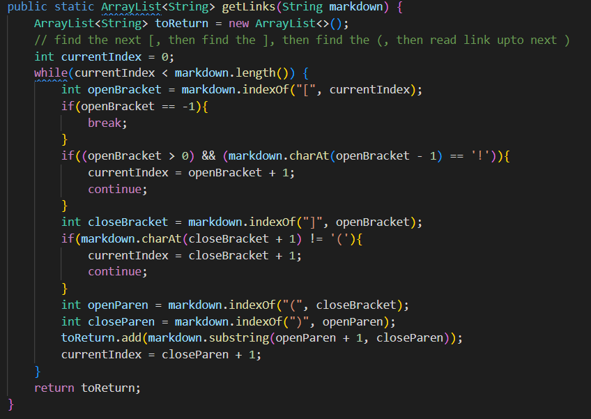
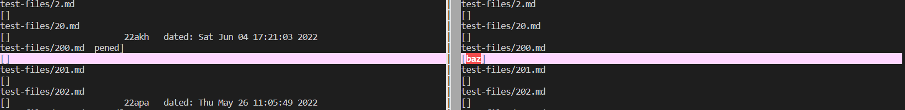
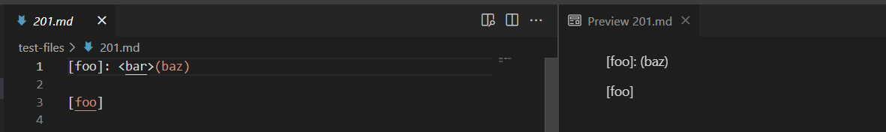
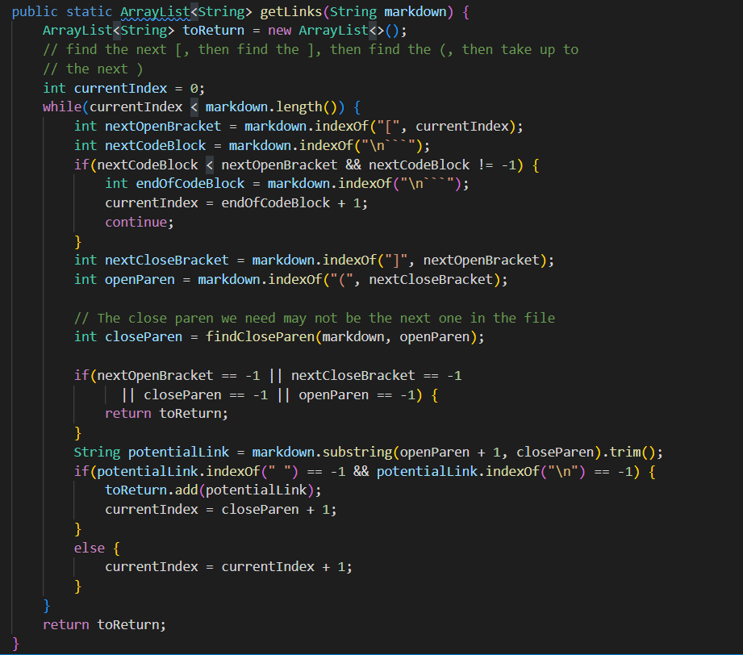

# Week 10 Lab Report

## Explaination
The method: I use `vimdiff` on the results of running a bash for loop?

Links of two test-files: [test-file 194](https://github.com/nidhidhamnani/markdown-parser/blob/main/test-files/194.md) and [test-file 201](https://github.com/nidhidhamnani/markdown-parser/blob/main/test-files/201.md)

## test-file 194 Analysis:
### Actual Outputs:

### Expected Outputs:

The expected link is [`title (with parens)`].
Thus, both implementations are incorrect.
### Description of Bugs:

After finding the ] in the command `int closeBracket = markdown.indexOf("]", openBracket)`, the program ignores a special condition about the link format before `if(markdown.charAt(closeBracket + 1) != '('){`. Since the markdown can use ':' with underscoring content to cite a link with ''. If there is ':' after closeBracke, the program shouldn't check the '()' with the underscoring. The program doesn't check this special case before looking for (). Also, when there is ':' and underscoring, the program doesn't include '' as a special case to include link.

## test-file 201 Analysis:
### Actual Outputs:

### Expected Outputs:

The expected link is []. Thus, only others' implementation is incorrect.
### Description of Bugs:

We should make a change between `int nextCloseBracket = markdown.indexOf("]", nextOpenBracket);` and `int openParen = markdown.indexOf("(", nextCloseBracket);`. Before looking for the next"(", the program ignores a special case when there is a <> with underscoring attaching with "()". If () is attached with <>, the program should breaks the loop and look for the next []. If there is a short space between <> and (), we will run the rest of codes.