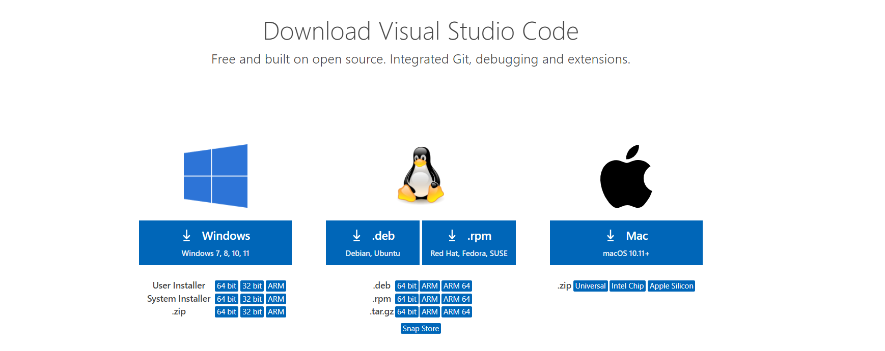
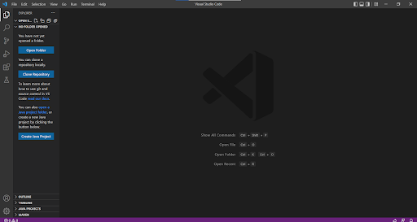
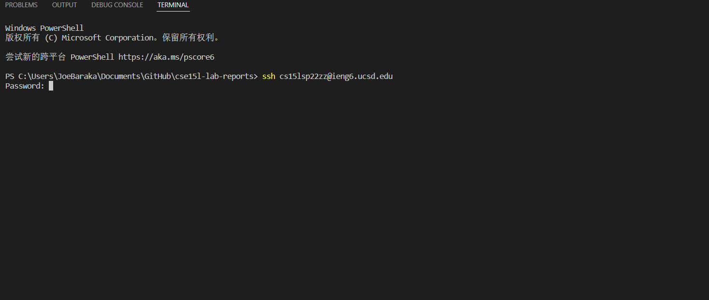
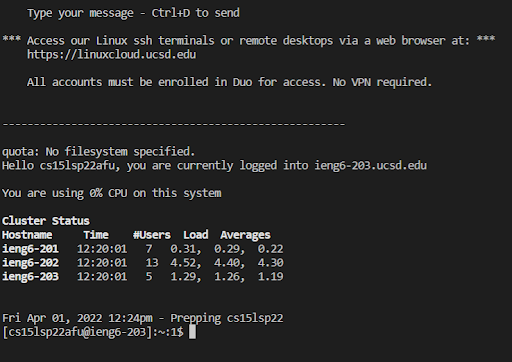
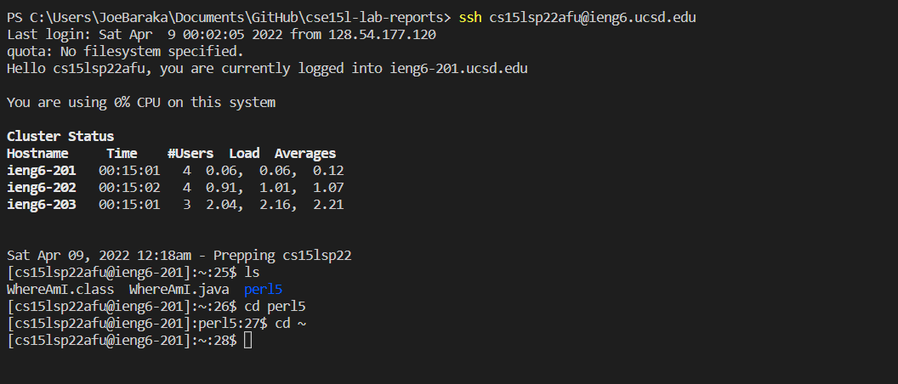
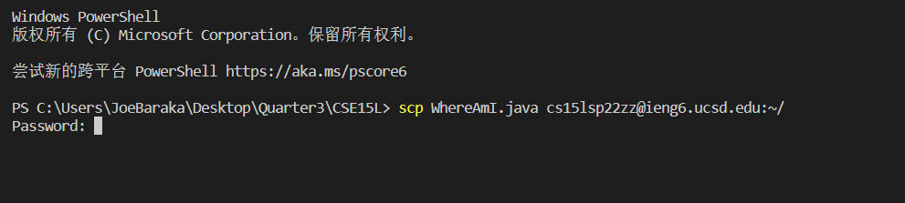
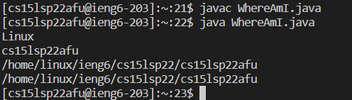

# Week 2 Lab Report - Remote Access

## Part 1 - Installing VScode
* Google VScode and download VScode in the computer
* After downloading the installation, keep continuing with defaut setting

* Open VScode

## Part 2 - Remotely Connecting
* Open a new terminal in VS code
* type the code `ssh cs15lsp22zz@ieng6.ucsd.edu` (Please replace the part `cs15lsp22zz` with your own account)

* enter your passwords about this ETS account. If everything is successful, you will get the result below

## Part 3 - Trying Some Commands
* try some specific commands in the server
  * `ls`
  * `cd filename`
  * `cd ~`
* you will see similar results below

## Part 4 - Moving Files with `scp`
* type code `scp WhereAmI.java cs15lsp22zz@ieng6.ucsd.edu:~/` in the terminal (Replace the java file with any java file you want)

* After successfully copying any java file into the server, try to run the java file in this server, like what shown below

## Part 5 - Setting an SSH Key
* type `ssh-keygen` in the terminal
* when you see `Enter file in which to save the key (/Users/<user-name>/.ssh/id_rsa):`, type `/Users/<user-name>/.ssh/id_rsa` 
* keep running untile 

## Part 6 - Optimizing Remote Running

