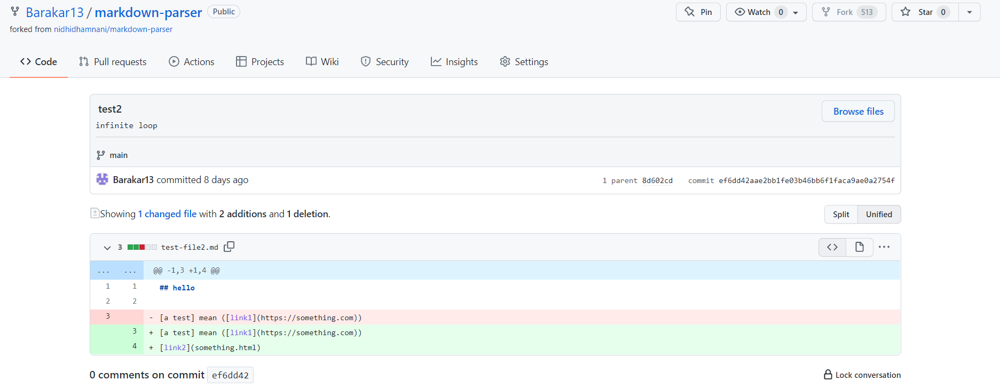
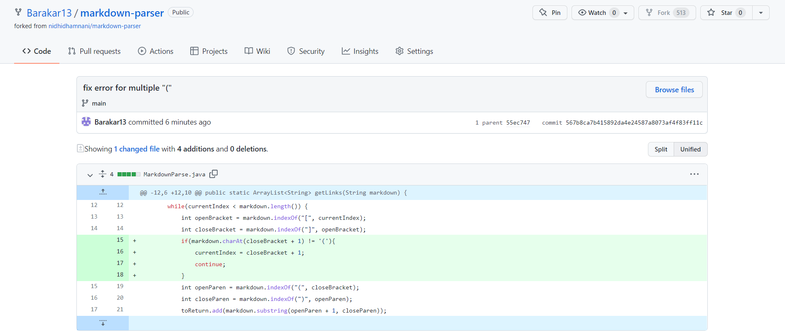
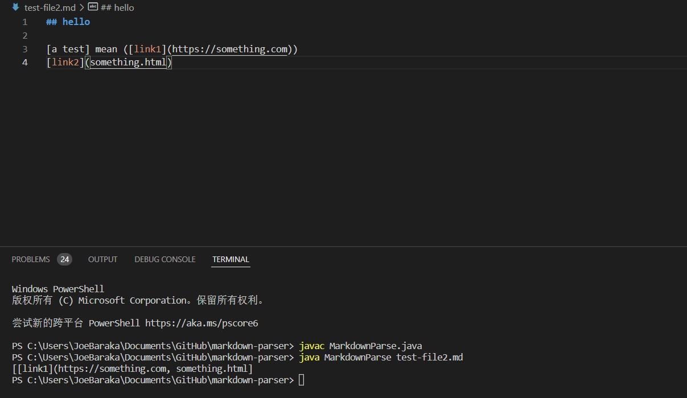
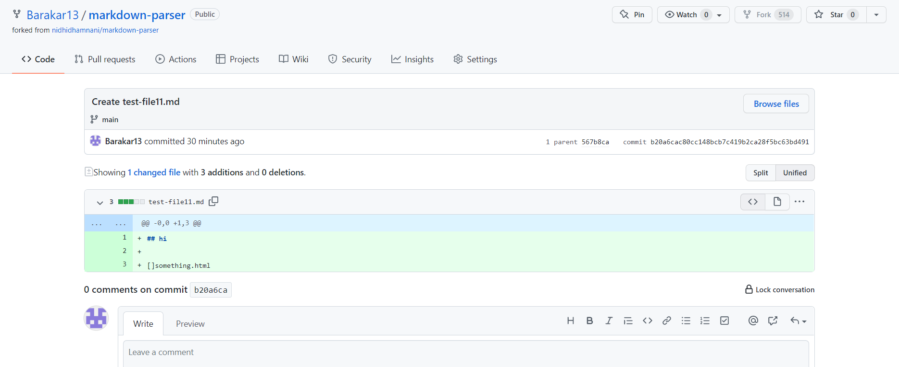
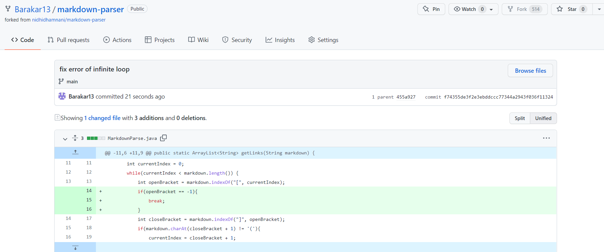
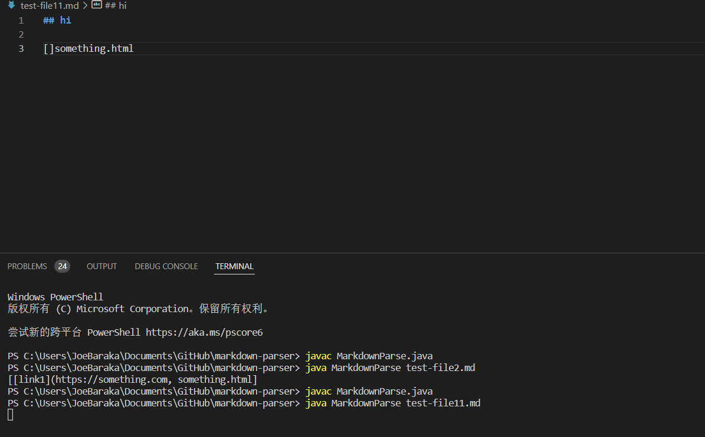
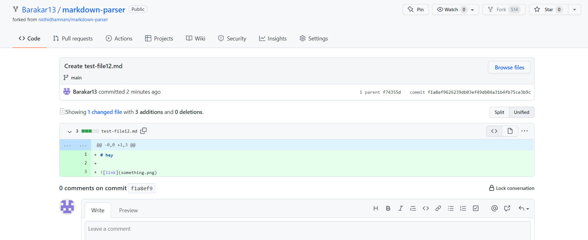
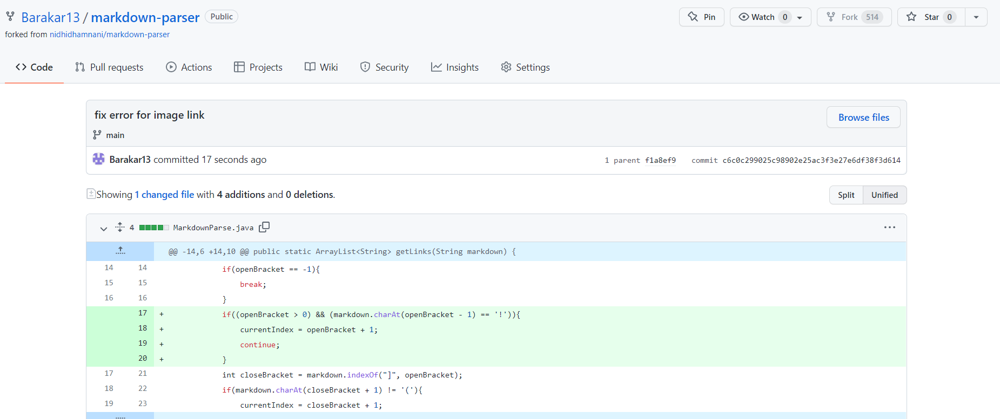
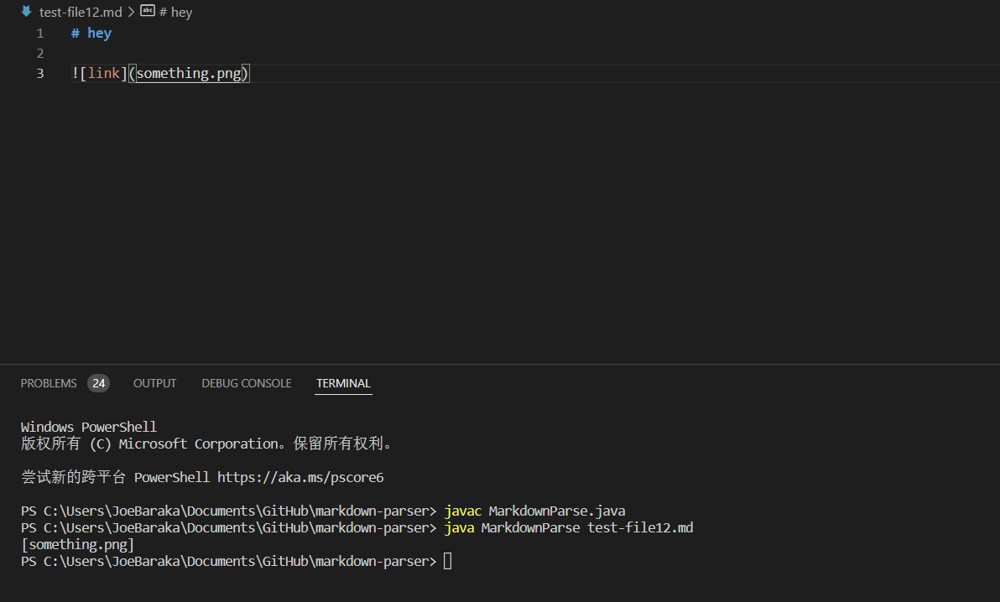

# Week 4 Lab Report - Bug Fix

## First Change - error for `` format
### code change
* test-file2.md changes:

* code change in MarkdownParse.java:

### *failure inducing input* in the test-file2.md
* link to the test file with the *failure inducint input*:
[test-file2.md](https://github.com/Barakar13/markdown-parser/blob/main/test-file2.md)
### symptom of that *failure-inducing input*

### Explanation the relationship among bug, symptom, and *failture inducing input*
After finding “]”, the program will look for the next “(“ and abstract the content in the “()”. However, the link format in the markdown require “”. Only in this case, the content in the “()” is a link. The bug of the program doesn’t focus on this format. The failure-inducing input adds content between “]” and “(“ and the program shouldn’t abstract the content in the “()”. Since the program doesn’t check whether the format is correct, the symptom of the program only gets the content in the “()” rather than a link in a format””.

## Second Change - error for an infinite loop
### code change
* test-file11.md changes:

* code change in MarkdownParse.java:

### *failure inducing input* in the test-file11.md
* link to the test file with the *failure inducint input*:
[test-file11.md](https://github.com/Barakar13/markdown-parser/blob/main/test-file11.md)
### symptom of that *failure-inducing input*

### Explanation the relationship among bug, symptom, and *failture inducing input*
Since my last change continue this for loop if the letter next to the “]” is not “(“, the program will have an infinite loop to look for “[]” if “[]” doesn’t exist after the first one, which fails has the format”.” My failure inducing input is to create only one [], which is not in the format”.” The symptom of my program will fall in an infinite loop. The bug of my program doesn’t stop the while loop to look for the next”[]“.

## Third Change - error for an image link
### code change
* test-file12.md changes:

* code change in MarkdownParse.java:

### *failure inducing input* in the test-file12.md
* link to the test file with the *failure inducint input*:
[test-file12.md](https://github.com/Barakar13/markdown-parser/blob/main/test-file12.md)
### symptom of that *failure-inducing input*

### Explanation the relationship among bug, symptom, and *failture inducing input*
Since the image link format is similar to the link format, the program will wrongly abstract an image link. The failure inducing input is an example of image link. The symptom of my program is to get an image link. The bug of my program doesn’t check the difference between image link and online link format in the Markdown.