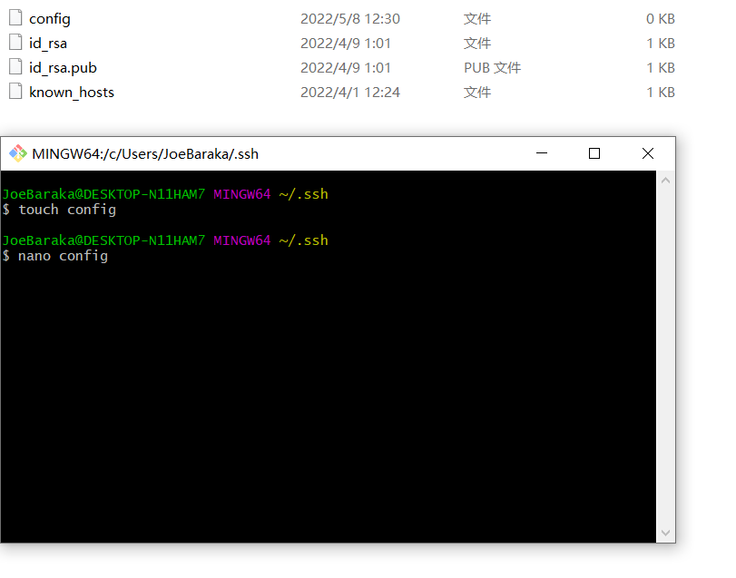

# Week 6 Lab Report - Group Choices in Lab 5

## Streamlining ssh Configuration
### Creation and edition of `.ssh/config`
Creation by Git Bash Here:

Edition by Git Bash Here:

### login my account using `ssh ieng6`

### copy a local file into my account using `scp`
I copy the file example.java into my account

## Setup Github Access from ieng6
