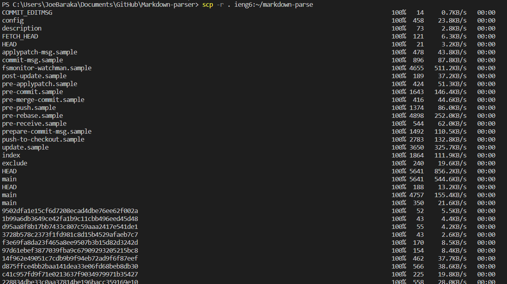

# Week 6 Lab Report - Group Choices in Lab 5

## Streamlining ssh Configuration
### Creation and edition of `.ssh/config`
Creation by Git Bash Here:

Edition by Git Bash Here:

### login my account using `ssh ieng6`

### copy a local file into my account using `scp`
I copy the file example.java into my account

## Setup Github Access from ieng6
### Public Key in Github

### Public Key and Private Key in User Account

### push a change and running process
I create an example.txt file and push this file to the Github from my account.

push new changes without passwords:

### link to this commit
[example.txt](https://github.com/Barakar13/markdown-parser/commit/6824cd4549234314adda8ec2e4390ad9e525b657)
or
"https://github.com/Barakar13/markdown-parser/commit/6824cd4549234314adda8ec2e4390ad9e525b657"

new commit link: [newCommit](https://github.com/Barakar13/markdown-parser/commit/12746078da8b3ab47a20a943f122bda1042f9d53) or "https://github.com/Barakar13/markdown-parser/commit/12746078da8b3ab47a20a943f122bda1042f9d53"

## Copy whole directories with `scp -r`
### Copy a whole directory to my ieng6 account

### login my ieng6 account and run tests in the copied directory

### combining `scp`, `;`, and `ssh` to copy the whole directory and run tests

