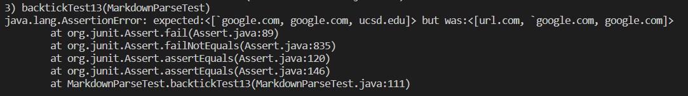
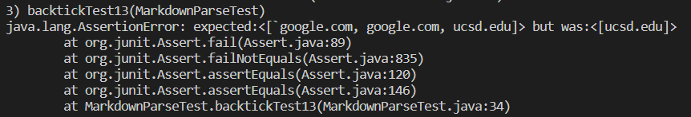

# Week 8 Lab Report

## Two Repository Links
### my repository:
[myRespository](https://github.com/Barakar13/markdown-parser) or https://github.com/Barakar13/markdown-parser
### reviewed repository:
[reviewRepository](https://github.com/gabrielseventhucsd25/markdown-parser) or https://github.com/gabrielseventhucsd25/markdown-parser

## Snippet1 - `backtickTest13`
### Expected Output

Expected Link list:[`google.com, google.com, ucsd.edu]
### Code in `MarkdownParseTest.java`

### JUnit Output in My Code

### JUnit Output in reviewed Code

## Snippet2 - `bracketTest14`
### Expected Output

Expected Link list:[a.com, a.com(()), example.com]
### Code in `MarkdownParseTest.java`

### JUnit Output in My Code

### JUnit Output in reviewed Code

## Snippet3 - `longTextTest15`
### Expected Output

Expected Link list:[https://sites.google.com/eng.ucsd.edu/cse-15l-spring-2022/schedule]
### Code in `MarkdownParseTest.java`

### JUnit Output in My Code

### JUnit Output in reviewed Code

## Answer the following questions 
### Do you think there is a small (<10 lines) code change that will make your program work for snippet 1 and all related cases that use inline code with backticks?

### Do you think there is a small (<10 lines) code change that will make your program work for snippet 2 and all related cases that nest parentheses, brackets, and escaped brackets?

### Do you think there is a small (<10 lines) code change that will make your program work for snippet 3 and all related cases that have newlines in brackets and parentheses?
